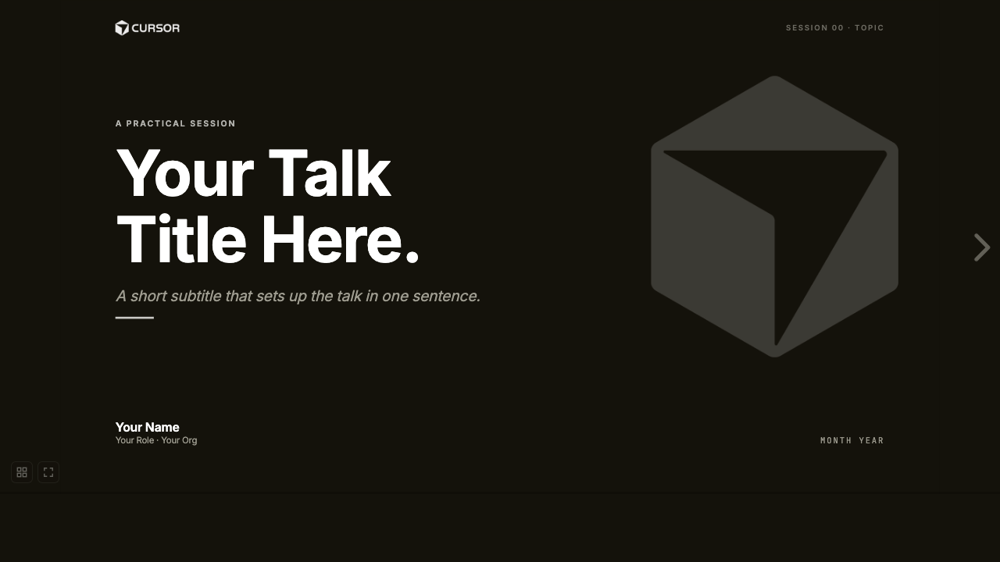

# Cursor Deck

A Cursor-branded Reveal.js deck template. One folder, one HTML file, one
CSS file. No build step, no framework, no slides.ts. Edit a `<section>`,
save, refresh.



## What's in here

Two decks, side by side:

| Folder                                  | What it is                                                              |
| --------------------------------------- | ----------------------------------------------------------------------- |
| [`template/`](template/)                | **Fork this.** Generic 10-slide starter covering every layout the theme ships with. |
| [`examples/cursor-nexo-security/`](examples/cursor-nexo-security/) | **Reference.** Real deck used for *Cursor × NEXO · Sesión 03 — Código Seguro con Cursor* (April 2026). |

Both share the same `theme.css` (latte cream / warm-grey palette) and the
same `cursor-brand-assets/` (symlinked from each deck's `brand/` folder).

## Quick start

```bash
git clone git@github.com:mascarock/cursor-deck.git
cd cursor-deck

# generic template
npm run present:template

# the real example
npm run present:example
```

Open <http://localhost:4321>. No `npm install` required — `serve` is
fetched on demand via `npx`.

## Edit a slide

Each slide is a `<section>` inside `template/index.html` (or any deck's
`index.html`). To add a slide, copy any existing `<section>`, paste it
where you want, and edit the content. To restyle the entire deck, change
the CSS variables at the top of `theme.css` — every component retints.

## Keyboard

| Key                  | Action                       |
| -------------------- | ---------------------------- |
| `→` / `Space`        | Next slide                   |
| `←`                  | Previous slide               |
| `F`                  | Fullscreen                   |
| `S`                  | Speaker view (notes + clock) |
| `O` / `ESC`          | Slide overview               |
| `?`                  | Keyboard help                |
| `B` / `.`            | Black-out screen             |

## Export to PDF

1. Open `http://localhost:4321/?print-pdf` in **Chrome / Brave** (Reveal's print mode).
2. File → Print → Save as PDF.
3. Layout: Landscape · Margins: None · Background graphics: ON.

## Theme tokens (`theme.css`)

| Variable          | Value     | Use                                      |
| ----------------- | --------- | ---------------------------------------- |
| `--paper`         | `#F7F7F4` | latte cream — main background            |
| `--ink`           | `#14120B` | warm near-black — text & dark slides     |
| `--accent`        | `#5C5A52` | warm grey accent                         |
| `--line`          | `#E6E5DD` | borders, dividers, tints                 |
| `--muted`         | `#6B6960` | secondary text                           |
| `--font-sans`     | Inter     | UI text                                  |
| `--font-mono`     | JetBrains Mono | code, numbers                       |

## Project structure

```
cursor-deck/
├── README.md
├── package.json
├── docs/preview.png
├── cursor-brand-assets/             # shared Cursor logos (cube, lockup, wordmark, …)
├── template/                        # ← fork this
│   ├── brand → ../cursor-brand-assets
│   ├── index.html
│   ├── theme.css
│   └── README.md
└── examples/
    └── cursor-nexo-security/        # ← real deck, kept verbatim
        ├── brand → ../../cursor-brand-assets
        ├── index.html
        ├── theme.css
        ├── partner.png
        └── README.md
```

## Brand assets

`cursor-brand-assets/` contains official Cursor brand assets (logos,
lockups, cube, wordmark, app icons, avatars). Use them in line with
[Cursor's brand guidelines](https://cursor.com). Intended for ambassador
talks and Cursor community events.

## License

MIT for the template code. Cursor brand assets retain Cursor's terms of use.

---

Built by [Niccolò Mascaro](https://x.com/mascarock) · Cursor Ambassador · LATAM.
