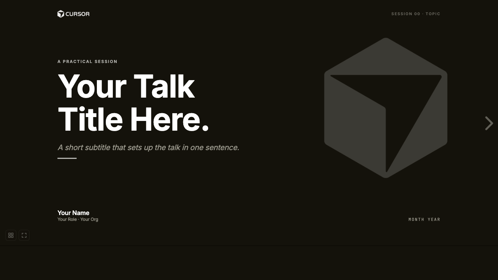

# Cursor Deck

A Cursor-branded Reveal.js deck template. One folder, one HTML file, one
CSS file. No build step, no framework, no slides.ts. Edit a `<section>`,
save, refresh.



## For AI agents

If you're an AI assistant editing this repo, read [`AGENTS.md`](AGENTS.md)
first — it's the universal brief covering slide anatomy, the chrome,
theme tokens, brand asset rules, and the workflow for adding a slide
without breaking the footer counters.

This repo also ships:

- [`CLAUDE.md`](CLAUDE.md) — Claude Code project memory
- [`.cursor/rules/`](.cursor/rules/) — five scoped Cursor rules (auto-fire on the right files)
- [`.github/copilot-instructions.md`](.github/copilot-instructions.md) — Copilot brief

Compatible with Cursor, Claude Code, Codex, GitHub Copilot, Windsurf,
Aider, Devin, Jules, JetBrains Junie, Zed, and anything else that reads
`AGENTS.md`.

## What's in here

| Folder | What it is |
| --- | --- |
| [`template/`](template/) | **Fork this.** Generic 10-slide starter covering every layout the Cursor theme ships with. |
| [`examples/cursor-nexo-security/`](examples/cursor-nexo-security/) | **Reference.** *Cursor × NEXO · Sesión 03 — Código Seguro con Cursor* (April 2026). |
| [`examples/cursor-model-training/`](examples/cursor-model-training/) | **Example.** How ML models are trained — data, loss, optimization, training loop. |
| [`examples/cursor-meetup-roma/`](examples/cursor-meetup-roma/) | **Community.** First Cursor Community Meetup in Rome (June 2026), Italian, 21 slides. |
| [`examples/cursor-crea-vender/`](examples/cursor-crea-vender/) | **Example.** Create & sell with Cursor. |
| [`examples/grok-bot-meetup/`](examples/grok-bot-meetup/) | **Grok Bot Community.** Cream / lavender 15-slide host deck (Malta + reusable). Own theme + assets — not the Cursor latte chrome. |


Cursor-branded decks share `theme.css` (latte cream / warm-grey) and
`cursor-brand-assets/` (symlinked as each deck's `brand/`). The Grok Bot deck
keeps its own `theme.css` and `assets/` (Grok mark, SpaceX wordmark, character blobs).

## Quick start

```bash
git clone git@github.com:cursorcommunityled/cursor-deck.git
cd cursor-deck

# generic template
npm run present:template

# NEXO webinar example
npm run present:example

# how to train models
npm run present:example-training

# Rome community meetup
npm run present:meetup-roma

# Grok Bot Community (cream / character blobs)
npm run present:grok-bot
```

Open <http://localhost:4321>. No `npm install` required — `serve` is
fetched on demand via `npx`.

## Edit a slide

Each slide is a `<section>` inside `template/index.html` (or any deck's
`index.html`). To add a slide, copy any existing `<section>`, paste it
where you want, and edit the content. To restyle the entire deck, change
the CSS variables at the top of `theme.css` — every component retints.

## Keyboard

| Key                  | Action                       |
| -------------------- | ---------------------------- |
| `→` / `Space`        | Next slide                   |
| `←`                  | Previous slide               |
| `F`                  | Fullscreen                   |
| `S`                  | Speaker view (notes + clock) |
| `O` / `ESC`          | Slide overview               |
| `?`                  | Keyboard help                |
| `B` / `.`            | Black-out screen             |

## Export to PDF

1. Open `http://localhost:4321/?print-pdf` in **Chrome / Brave** (Reveal's print mode).
2. File → Print → Save as PDF.
3. Layout: Landscape · Margins: None · Background graphics: ON.

## Theme tokens (`theme.css`)

| Variable          | Value     | Use                                      |
| ----------------- | --------- | ---------------------------------------- |
| `--paper`         | `#F7F7F4` | latte cream — main background            |
| `--ink`           | `#14120B` | warm near-black — text & dark slides     |
| `--accent`        | `#5C5A52` | warm grey accent                         |
| `--line`          | `#E6E5DD` | borders, dividers, tints                 |
| `--muted`         | `#6B6960` | secondary text                           |
| `--font-sans`     | Inter     | UI text                                  |
| `--font-mono`     | JetBrains Mono | code, numbers                       |

## Project structure

```
cursor-deck/
├── README.md
├── package.json
├── docs/preview.png
├── cursor-brand-assets/             # shared Cursor logos
├── template/                        # ← fork this (Cursor theme)
│   ├── brand → ../cursor-brand-assets
│   ├── index.html
│   ├── theme.css
│   └── README.md
└── examples/
    ├── cursor-nexo-security/
    ├── cursor-model-training/
    ├── cursor-meetup-roma/
    ├── cursor-crea-vender/
    └── grok-bot-meetup/             # Grok Bot Community (own theme + assets/)
        ├── index.html
        ├── theme.css
        ├── assets/                  # grok marks, spacex wordmark, chars/
        └── README.md
```

## Brand assets

`cursor-brand-assets/` contains official Cursor brand assets (logos,
lockups, cube, wordmark, app icons, avatars). Use them in line with
[Cursor's brand guidelines](https://cursor.com). Intended for ambassador
talks and Cursor community events.

The **Grok Bot** example does not use those assets. Its marks and character
art live under `examples/grok-bot-meetup/assets/` — see that folder's README.

## License

MIT for the template code. Cursor brand assets retain Cursor's terms of use.
Grok Bot / SpaceX marks in the Grok example remain subject to xAI / SpaceX terms.


---

Built by [Niccolò Mascaro](https://x.com/mascarock) · Cursor Ambassador · LATAM.
