# Grok Bot Community — deck

Host / community deck for **Grok Bot**: cream paper, lavender accents, character
blobs, and the official Grok mark. Built for the Malta meetup (Thu 17 Sep 2026,
Coffee Circus Porto) and reusable for any Grok Bot Community night.

English, **15 slides**. Pure HTML + Reveal.js 5.1.0, no build step — same stack
as the other decks in this repo.

## Preview

Fresh captures of the live deck (`preview/slide-01.png` … `slide-15.png`).

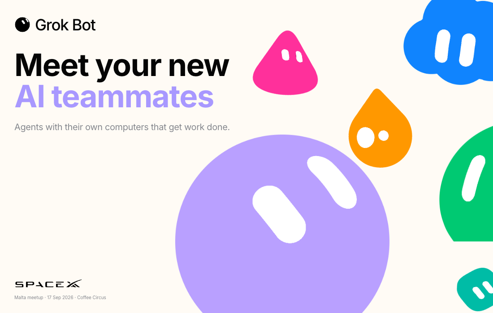

### 02 · AI Maturity Curve

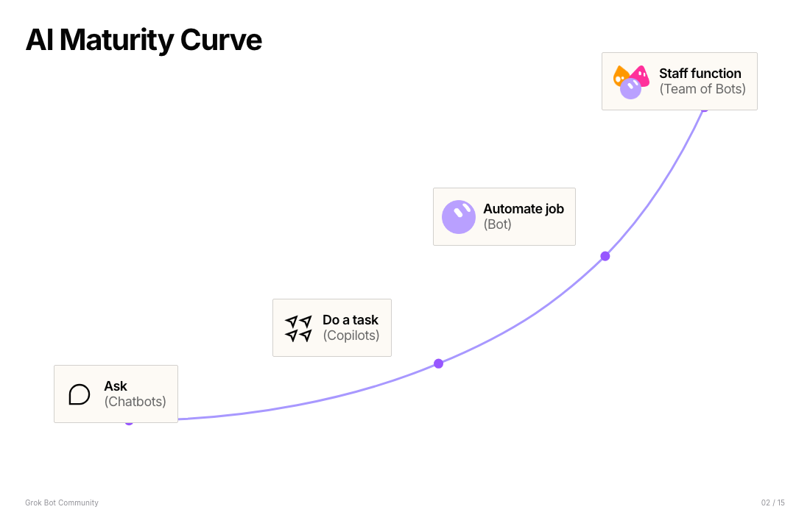

### 03 · Today everyone spends time on routine work

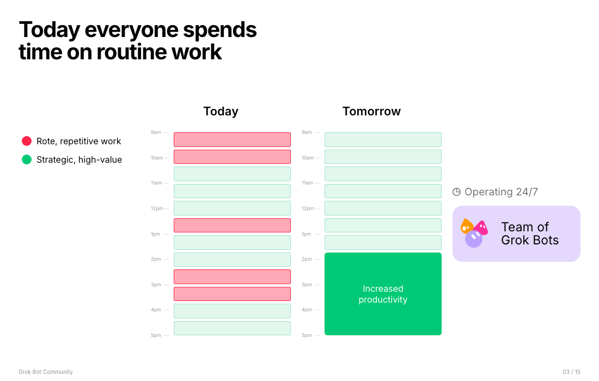

### 04 · Introducing

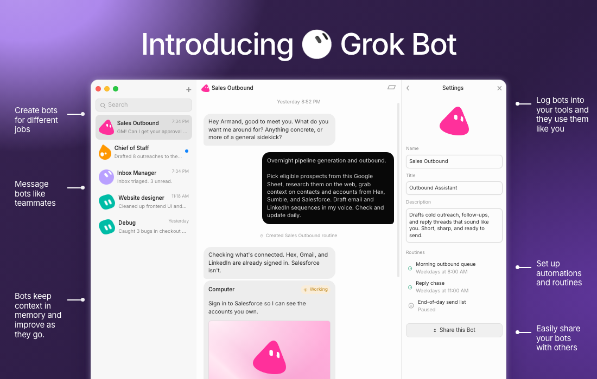

### 05 · The challenge with most agents

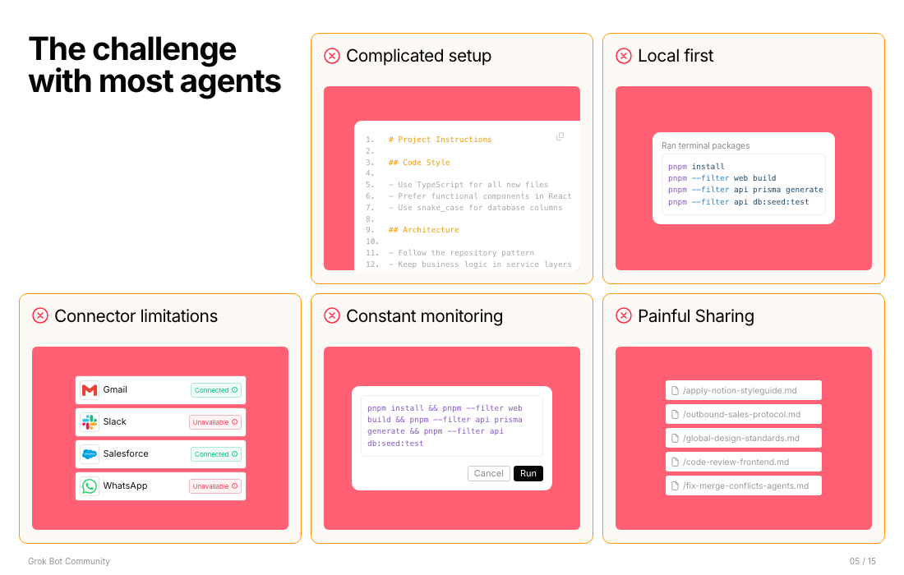

### 06 · Demo

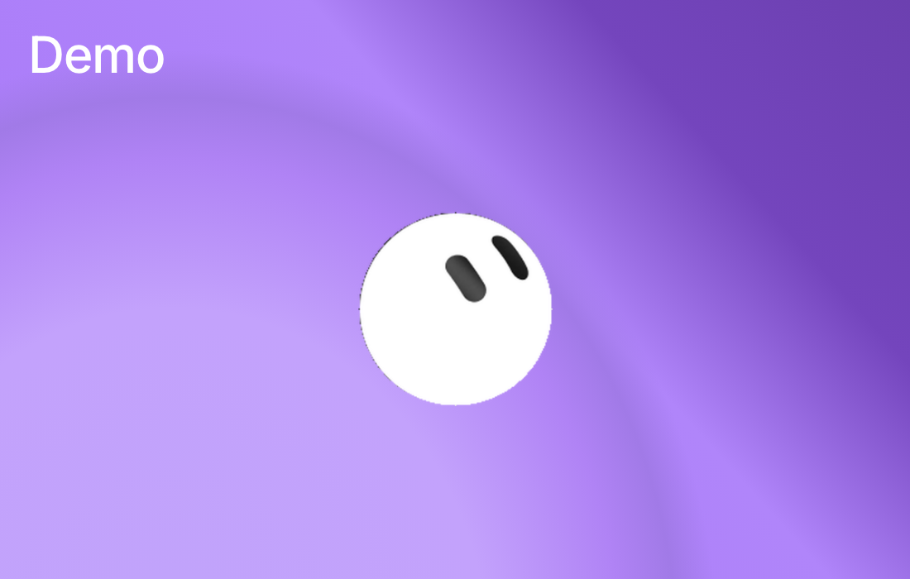

### 07 · Why customers choose Grok Bot

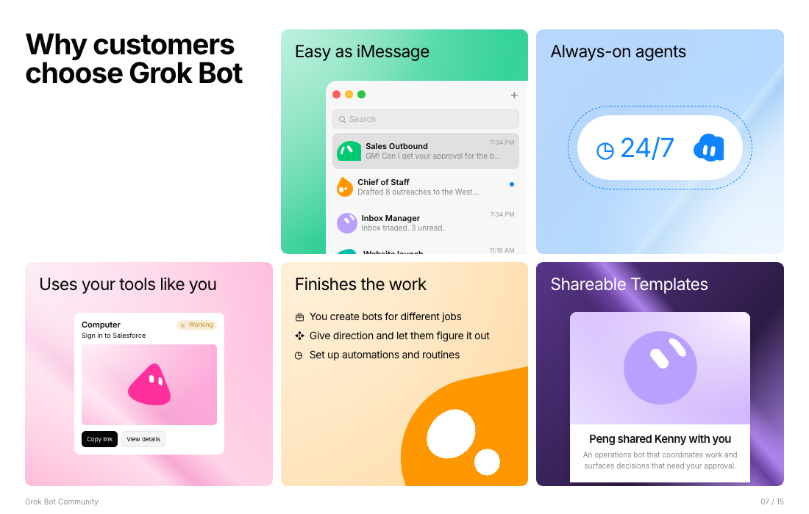

### 08 · Available now

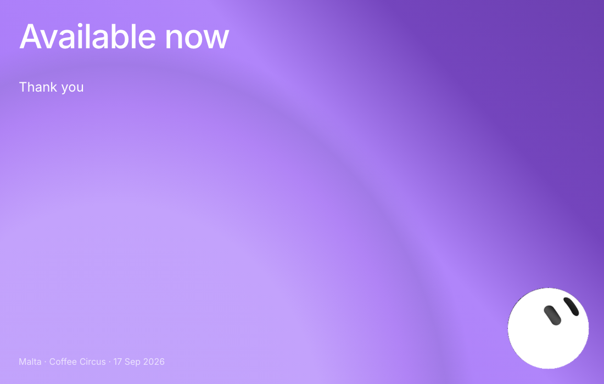

### 09 · Getting Started: Give each Bot a job

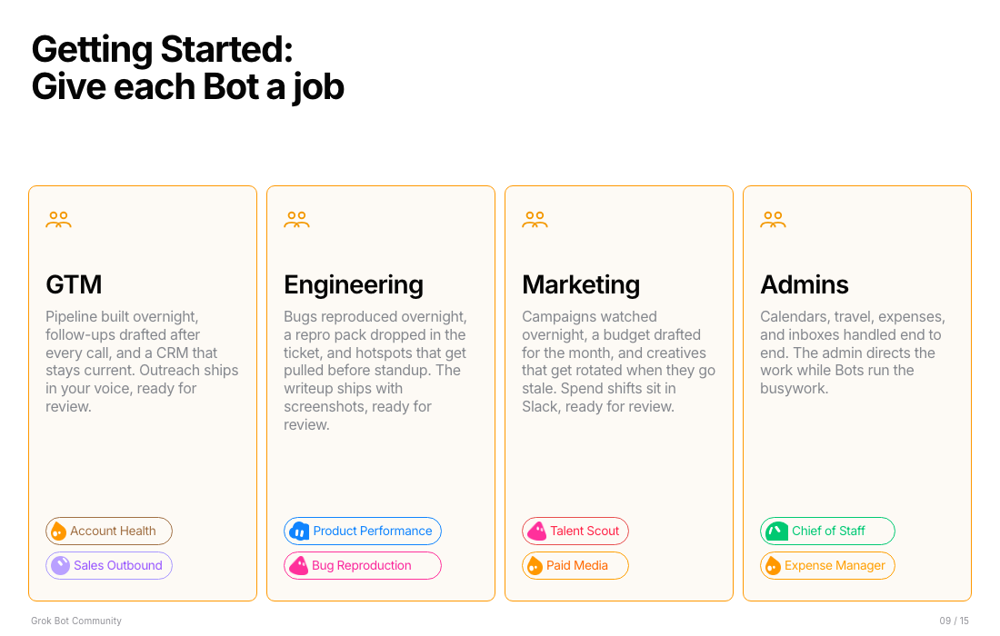

### 10 · Put your GTM strategy into action


### 11 · Ship more, with less coordination overhead

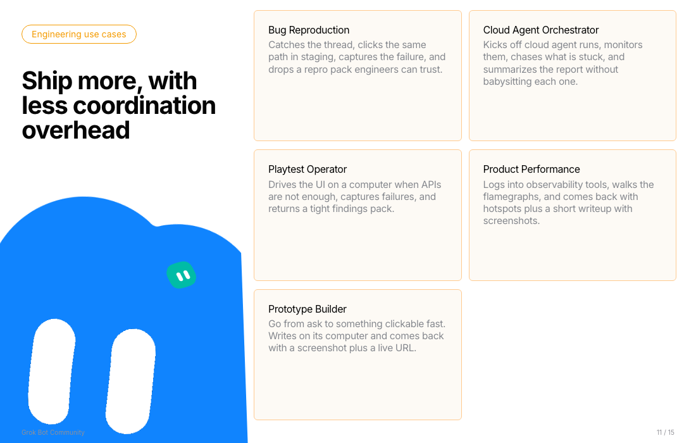

### 12 · Keep the company running at breakneck pace

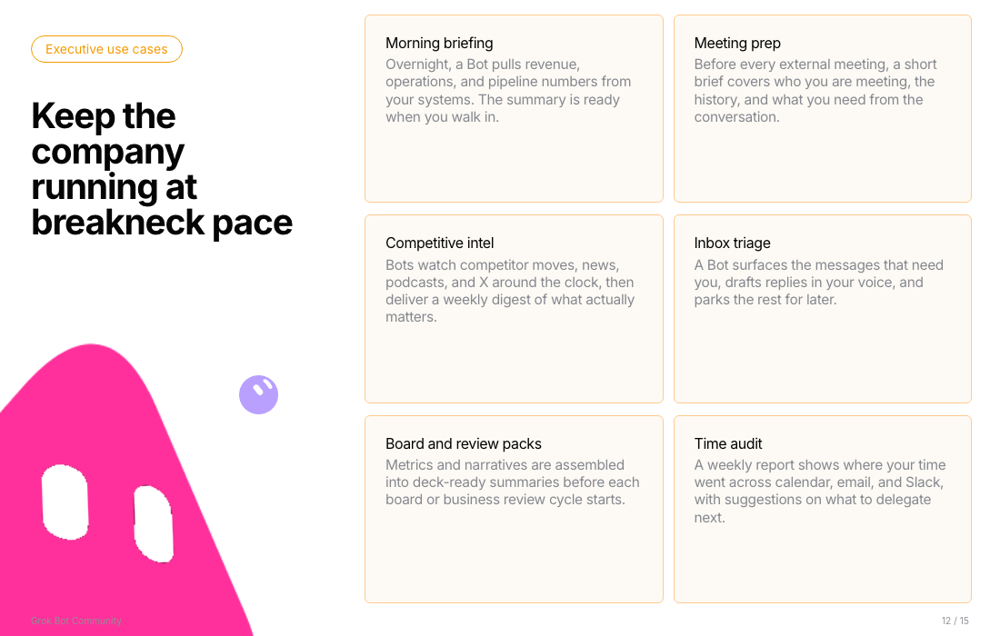

### 13 · Security

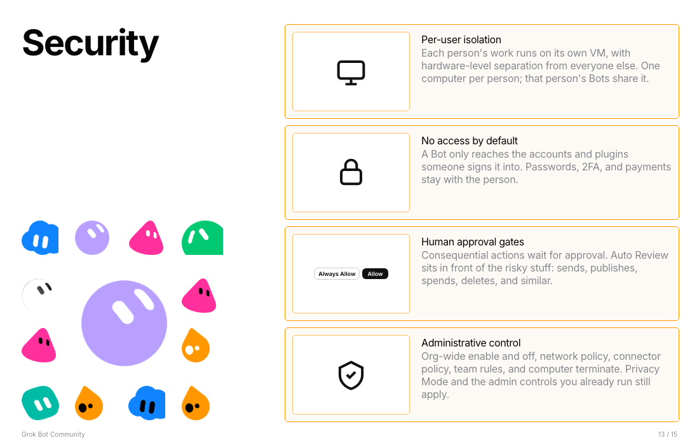

### 14 · AI is evolving fast

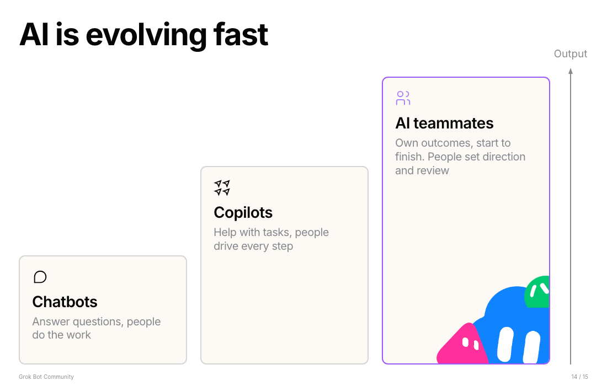

### 15 · Finale

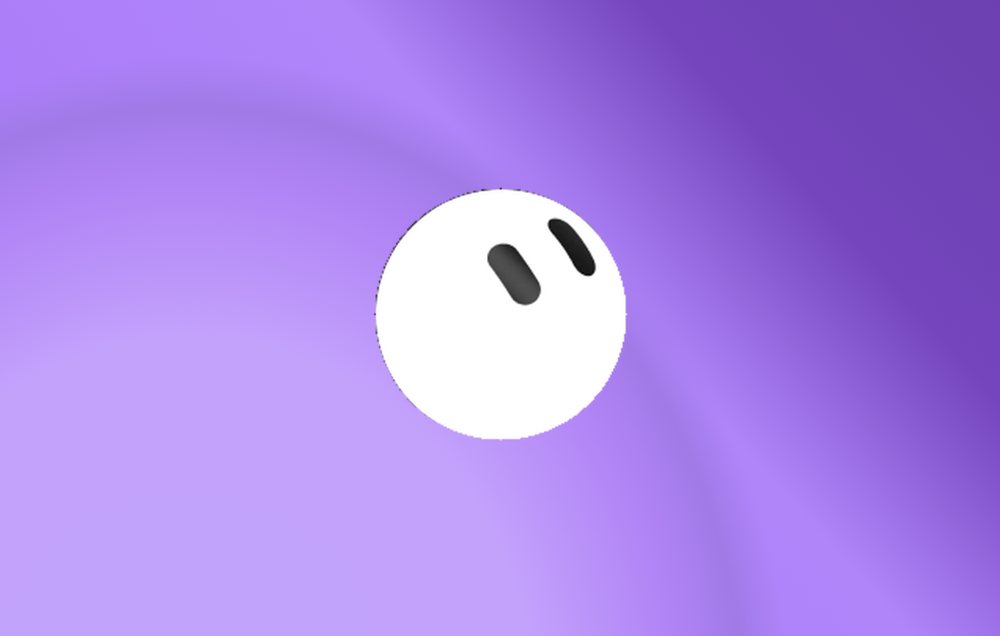

## Visual system

High-fidelity to the Grok Bot Community Google Slides template (cream / white /
lavender), **not** the Cursor latte theme and **not** the black Amsterdam Luma look.

| Token | Value | Use |
| --- | --- | --- |
| `--paper` | `#FBF9F4` | cream slides |
| `--cover-paper` | `#FFFBF5` | cover |
| `--ink` | `#050505` | titles |
| `--body` | `#85888E` | secondary copy |
| Accents | lavender / pink / orange / blue / green / teal | blobs + highlights |

**Chrome**

- Top-left brand lockup: official Grok circle mark (`assets/grok-mark-on-light-128.png` on cream, `assets/grok-mark-128.png` on dark) + **Grok Bot** wordmark — never the Cursor cube.
- Bottom-left: SpaceX wordmark (`assets/spacex-wordmark.png`), not a text fake.
- Footer label: `Grok Bot Community` · `NN / 15`.

**Characters**

Raster blobs in `assets/chars/` (purple hero, pink tri, blue cloud, orange tear,
green dome, teal square). Cover composition mirrors the template cluster
(`cover-cluster` + absolute placement). Do not stretch with `object-fit: cover`;
keep `object-fit: contain` and `width: auto`.

Older alpha cuts in `assets/blobs/` remain for reference; slides use `chars/`.

## Run

```bash
npm run present:grok-bot   # from repo root → http://localhost:4321
```

`S` = speaker notes · `F` = fullscreen · `O` = overview · arrows = navigate.
Print to PDF: open `http://localhost:4321/?print-pdf`, then Chrome → Print → Save as PDF.

## Slides

| # | Slide | Layout |
| --- | --- | --- |
| 01 | Meet your new AI teammates | cream cover · title + char cluster |
| 02 | AI Maturity Curve | white · curve / stages |
| 03 | Today everyone spends time on routine work | white · problem framing |
| 04 | Introducing | product intro |
| 05 | The challenge with most agents | cream · challenge |
| 06 | Demo | title beat |
| 07 | Why customers choose Grok Bot | white · reasons |
| 08 | Available now | availability |
| 09 | Getting Started: Give each Bot a job | cream · jobs |
| 10 | Put your GTM strategy into action | white · GTM use cases |
| 11 | Ship more, with less coordination overhead | white · eng / ops |
| 12 | Keep the company running at breakneck pace | white · ops pace |
| 13 | Security | cream · security |
| 14 | AI is evolving fast | cream · closing thesis |
| 15 | (finale) | Grok mark closer |

## What's in this folder

| Path | What it is |
| --- | --- |
| `index.html` | 15-slide deck. Speaker notes in each `<aside class="notes">`. |
| `theme.css` | Cream / white Community theme, chrome, char-blob, cover-cluster, progress bar. |
| `assets/grok-mark-*.png` | Official Grok circle mark (light + dark variants). |
| `assets/grok-mark-on-light-*.png` | Black-circle mark for cream / white slides. |
| `assets/spacex-wordmark.png` | SpaceX wordmark used in the footer lockup. |
| `assets/chars/*.png` | Template-cut character blobs with alpha (preferred on slides). |
| `assets/blobs/*.png` | Earlier Amsterdam-family alpha cuts (reference). |
| `preview/` | PNG screenshots of all 15 slides (1100×700) for this README. |
| `brand/` | Symlink → Cursor brand assets. **Unused** by this deck — Grok marks live under `assets/`. |

## Sources

- Product framing follows xAI's **Introducing Grok Bot** post and **x.ai/bot**.
- Event details for the Malta night: **luma.com/grok-malta**.
- Visual reference: Grok Bot Community Google Slides template + Figma
  `Grok Bot thumbnails [temp]` (`3PcKyybEoc6SAqysnCb5HA`).
- No live seat counts or pricing on slides — those change; point people to Luma / x.ai/bot.

## Editing notes

- Slides are sequential `<section>` blocks. Footer counters are `NN / 15` —
  **bump every slide** if you add or remove one.
- Prefer `assets/chars/*.png` + `class="char-blob"` over CSS eye blobs or masks.
- Cover cluster positions are intentional; tweak `theme.css` `.cover-cluster` /
  `.b-*` rules rather than stretching the PNGs.
- Keep Grok marks and the SpaceX wordmark as images. Do not swap in Cursor logos.
- No QR on the closer yet. Reuse `.qr-card` from `examples/cursor-meetup-roma/`
  if you want one for `luma.com/grok-malta`.
